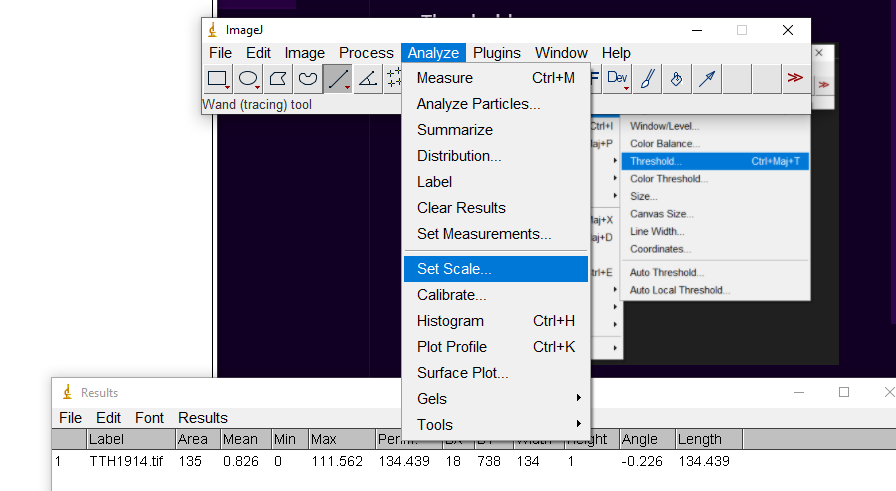
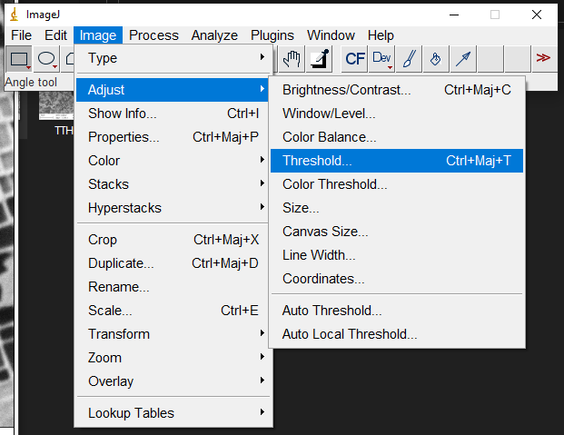
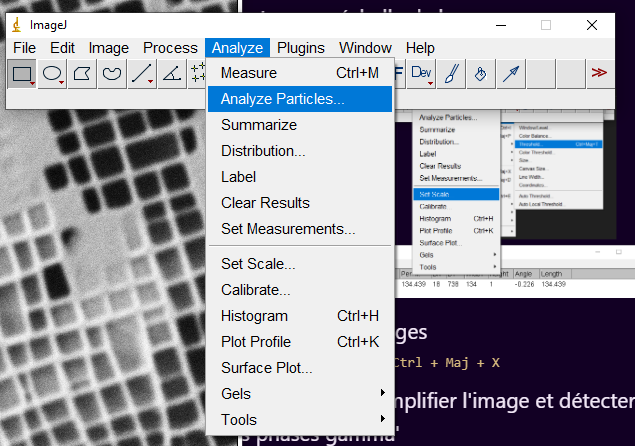

# Analyse des images

## Rentrer une échelle de longueur

Tracer un trait sur l'échelle de l'image, puis :

  

## puis `crop image`

tracer un rectangle et faire `Ctrl + Maj + X`

## `Threshold` pour simplifier l'image et détecter les phases gamma'

  

## puis `analyse particules`

  

